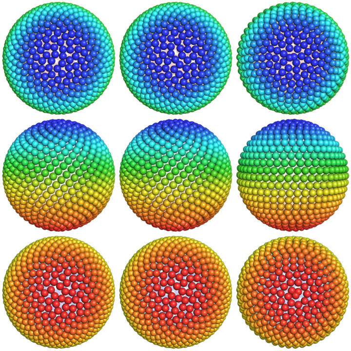

:mod:`MathTools` --- Mathematical tools
=======================================

.. module:: MathTools
   :synopsis: Mathematical tools.
.. moduleauthor:: Christoph Wilms <christoph.wilms@uni-due.de>
.. sectionauthor:: Jean-Noel Grad <jean-noel.grad@uni-due.de>

This module provides a set of mathematical functions used by other modules.

The main feature of this module is the computation of spherical lattices.
At the exception of the platonic solids, there is no general rule for placing 
*N* equidistant points on a sphere. Several methods are discussed in the
literature, such as uniform longitude/latitudes, adaptative
longitude/latitudes, the Saff-Kuijlaars algorithm, and Fibonacci generative
spirals. Figure 1 shows various methods available in Epitopsy.

.. _MathToolsSphericalLattice:

  
    **Figure 1**: Spherical lattices available in Epitopsy.
    
    From left to right: Boucher, Gonzalez and Saff-Kuijlaars algorithms, using
    800 dots. 
    
    From top to bottom: view from a pole, from the equator, and from
    the opposite pole.

.. _MathTools-syntax:

Module Syntax
-------------

Empty.

.. _contents-of-module-MathTools:

Module Contents
---------------

.. automodule:: epitopsy.tools.MathTools
    :members:
    :undoc-members:
    :show-inheritance:

